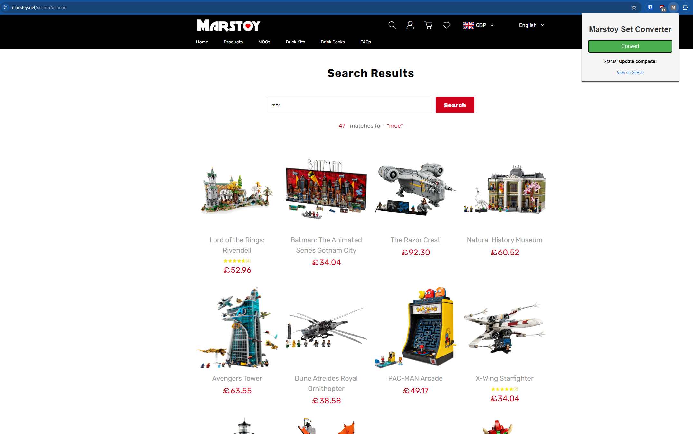
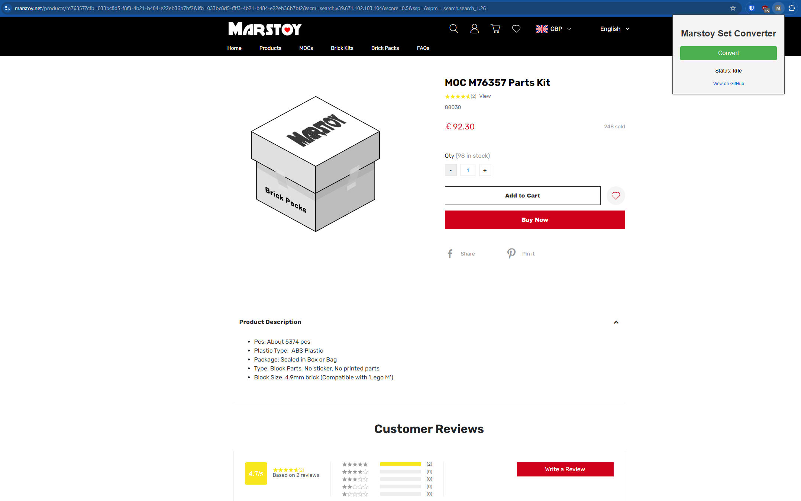
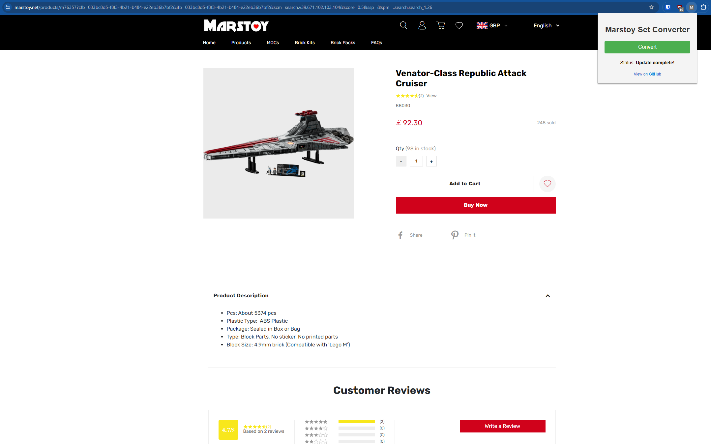

# Marstoy Set Converter

**Marstoy Set Converter** is a browser extension designed to update product titles and images on Marstoy.net. It retrieves accurate information from the Rebrickable API based on product IDs and updates the page with the correct LEGO set name and image.

## Features

- **Title Conversion:** Automatically updates the product title to match the correct LEGO set name from Rebrickable.
- **Image Conversion:** Replaces the product image with the official LEGO set image retrieved from Rebrickable.
- **Easy to Use:** Converts all products with the format "MOC M<ID> Parts Kit" on both product listing pages and individual product pages.
- **Cross-Browser Compatibility:** Works on Chrome, Edge, Brave, and Firefox.

## Screenshots

### Before and After Conversion - Product Search Page
**Before:**


**After:**


### Before and After Conversion - Specific Product Page
**Before:**


**After:**


## Prerequisites

To use this extension, you must have a Rebrickable API key. Follow the steps below to obtain your API key.

### Obtaining a Rebrickable API Key

1. Sign up for a free account on Rebrickable: [Rebrickable Signup](https://rebrickable.com/signup/).
2. After signing up, navigate to your [API settings](https://rebrickable.com/users/LookupGuy/settings/#api).
3. Generate a new API key and copy it.

## Installation

### Chrome, Edge, and Brave:

1. Clone or [download](https://github.com/BjornstadThomas/MarstoyIdConverter-Extension/archive/refs/heads/main.zip) this repository to your local machine.
2. Open your browser and navigate to `chrome://extensions/` (for Chrome or Brave) or `edge://extensions/` (for Edge).
3. Enable "Developer mode" in the top right corner.
4. Click "Load unpacked" and select the "Chrome" directory where you downloaded the extension files.
5. Open the `content.js` file in a text editor and replace the placeholder API key with your actual Rebrickable API key:
   ```javascript
   const apiKey = 'your-api-key-here';
   ```

### Firefox:

1. Clone or download this repository to your local machine.
2. Open Firefox and navigate to `about:debugging#/runtime/this-firefox`.
3. Click "Load Temporary Add-on" and select the `manifest.json` file from the "Firefox" extension's directory.
4. Open the `content.js` file in a text editor and replace the placeholder API key with your actual Rebrickable API key:
   ```javascript
   const apiKey = 'your-api-key-here';
   ```

## Usage

1. **Navigate to Marstoy.net**:
   - Open your browser and go to [Marstoy.net](https://marstoy.net).
   - Visit Brick Kits [page](https://www.marstoy.net/collections/alternative-set) OR use the search bar to search for "MOC" to retrieve all products with "MOC" in the title, or navigate directly to a specific product.

2. **Convert Titles and Images**:
   - Click on the Marstoy Set Converter extension icon in your browser's toolbar.
   - Click the "Convert" button to start the conversion process.
   - The extension will automatically update the titles and images on the page for all products in the format "MOC M<ID> Parts Kit".

3. **Check the Status**:
   - The status of the conversion process will be displayed within the extension popup. Once complete, it will show "Update complete!".

## Disclaimer

This extension is intended for educational purposes only. **Marstoy Set Converter** is not affiliated with LEGO, Marstoy, or Rebrickable. The use of this extension is at your own risk. Please use this extension in accordance with the relevant legal terms and conditions.

## Troubleshooting

- Ensure that the API key in `content.js` is correct and that you have an active internet connection.
- The extension only converts products with the format "MOC M<ID> Parts Kit". Other formats will not be affected.
- If you encounter issues, try reloading the Marstoy page and running the conversion again.

## Contributions

Contributions, issues, and feature requests are welcome! Feel free to check the [issues page](https://github.com/BjornstadThomas/MarstoyIdConverter-Extension/issues) to raise a new issue or submit a pull request.

## License

This project is licensed under the MIT License. See the [LICENSE](https://github.com/BjornstadThomas/MarstoyIdConverter-Extension/blob/main/LICENSE) file for details.
